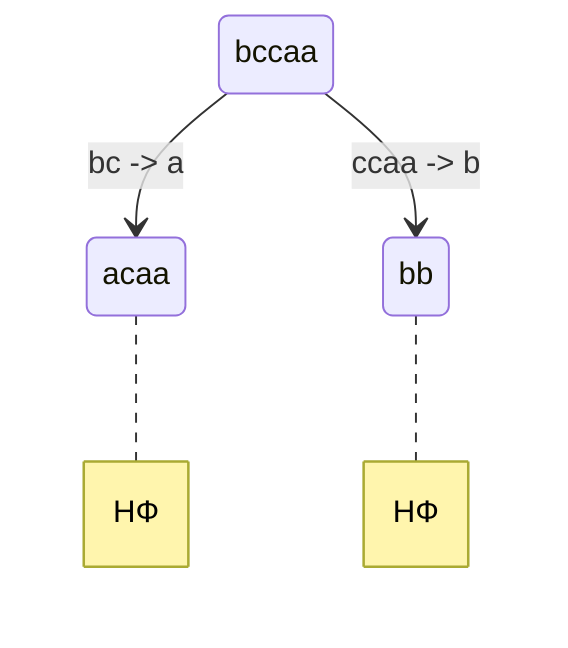
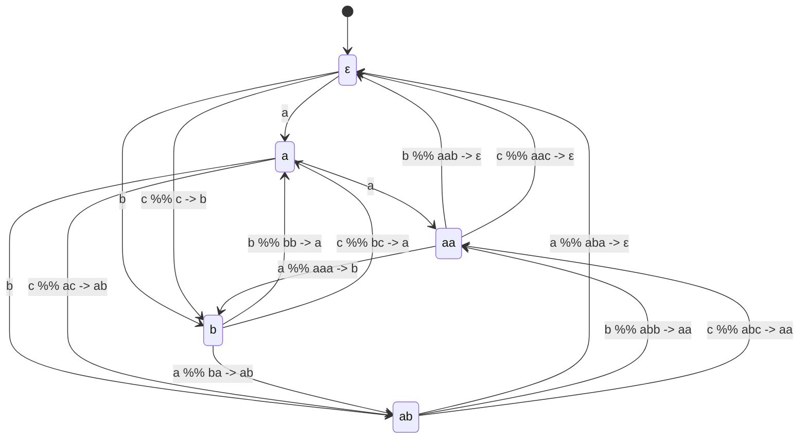
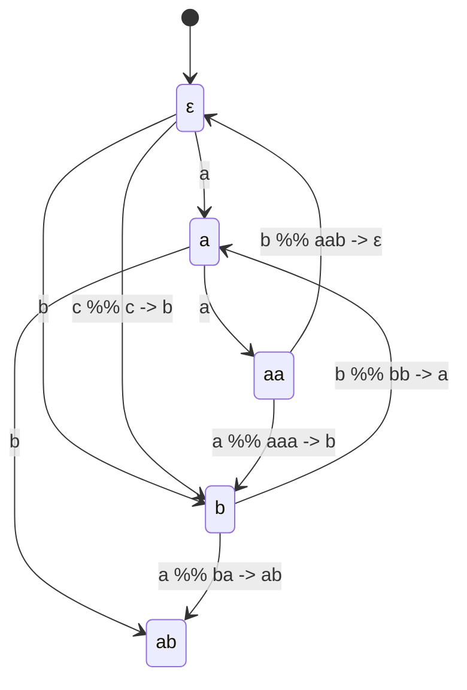

# Lab 1

## Условие

По имеющейся SRS определить:

- завершимость
- конечность классов эквивалентности по НФ (для построения эквивалент-
  ностей считаем, что правила могут применяться в обе стороны). Если их
  конечное число, то построить минимальную систему переписывания, им
  соответствующую.
- локальную конфлюэнтность и пополняемость по Кнуту-Бендиксу

### Исходная система переписывания

```math
\left\{ \begin{aligned}

    aabc  &\rightarrow bbaa \\
    b  &\rightarrow ccaa \\
    bc  &\rightarrow a \\
    aac  &\rightarrow ε \\

\end{aligned} \right.
```

## Решение

### Завершимость

1. Используя [AProVE](https://aprove.informatik.rwth-aachen.de/interface/v-AProVE2023/srs_wst), проверяем систему на завершимость

```
(RULES
    a a b c -> b b a a ,
    b -> c c a a ,
    b c -> a ,
    a a c ->
)
```

Калькулятор, через матричную интерпретацию a, b, c, используя натуральные числа с минус бесконечностью,
доказывает, что система завершается.

2. Используя метод проб и ошибок, введем следующий порядок $\succ_{\text{L}}$:

- Читаем справа налево
- Лексикографически оцениваем ($\prec_{\text{lex}}$) по алфавиту: $a \prec b \prec c$
- Если суффиксы равны, то больше то слово, что длиннее: $\varepsilon \prec a$

Проверим каждое правило на уменьшение в этом порядке:

```math
\left\{
\begin{aligned}

aabc &\rightarrow bbaa; \quad
\left(aab\underline{c} \succ_{\text{L}} bba\underline{a} \right) \Rightarrow Уменьшается \\

b &\rightarrow ccaa; \quad
\left(\underline{b} \succ_{\text{L}} cca\underline{a} \right) \Rightarrow Уменьшается \\

bc &\rightarrow a; \quad
\left(b\underline{c} \succ_{\text{L}} \underline{a} \right) \Rightarrow Уменьшается \\

aac &\rightarrow \varepsilon; \quad
\left(ссa\underline{a}c \prec_{\text{L}} \underline{c}c \right) \Rightarrow Неизвестно \\


\end{aligned}
\right.
```

Тогда несмотря на отсутствие строгого уменьшения в последнем правиле, все остальные правила строго уменьшают слово в этом порядке.

Заметим также, что последнее правило невозможно применять бесконечно, так как рано или поздно все $aac$ перейдут в пустую строку.

Таким образом, каждый раз иссекая $aac$, мы будем гарантировано уменьшать слово по порядку $\succ_{\text{L}}$, что означает отсутствие бесконечных цепочек переписывания и завершимость системы.

> [Замечу также возможное противоречие](./kb.md)

### Конечность классов эквивалентности по НФ

Поскольку правила переписывания никак не затрагивают $c$ отдельно, то $\forall n \geq 0$ слово $c^n$ не изменяется системой и является нормальной формой.

Таким образом, существует бесконечно много классов эквивалентности по нормальной форме, соответствующих $c^n$ для всех $n$.

### Локальная конфлюэнтность и пополняемость по Кнуту-Бендиксу

#### Shortlex

Переориентируем правила в порядке shortlex для фундированности
(сначала по длине, затем по алфавиту: $a < b < c$):

```math
\left\{
\begin{aligned}
&bbaa \rightarrow aabc (*) \\
&ccaa \rightarrow b  (*) \\
&bc \rightarrow a \\
&aac \rightarrow \epsilon \\
\end{aligned}
\right.
```

Запустим [алгоритм Кнуту-Бендикса](./solution/src/bin/kb.rs) на переориентированной системе

#### Локальная конфлюентность

Программа разбирет критические пары и добавит недостающие правила.

Например для слова $bccaa$ добавится правило $acaa \rightarrow bb$:



#### Пополняемость по Кнуту-Бендиксу

В итоге получим такую систему переписывания:

```math
\left\{
\begin{aligned}
&bbaa \rightarrow aabc \\
&ccaa \rightarrow b \\
&bc \rightarrow a \\
&aac \rightarrow \epsilon \\
\\[2ex]
&c \rightarrow b \\
&ac \rightarrow ab \\
&ba \rightarrow ab \\
&bb \rightarrow a \\
&ca \rightarrow ab \\
&cb \rightarrow a \\
&aaa \rightarrow b \\
&aab \rightarrow \epsilon \\
&caa \rightarrow aab \\
&cab \rightarrow aa \\
&cca \rightarrow cab \\
&ccb \rightarrow ca \\
&aaaa \rightarrow ab \\
&aaab \rightarrow a \\
&acaa \rightarrow bb \\
&ccab \rightarrow aab \\
&aaaaa \rightarrow aab \\
&aaaab \rightarrow aa \\
&aaaaab \rightarrow aaa \\
\end{aligned}
\right.
```

#### Конечность классов эквивалентности по НФ

Используя эквивалентну систему переписывания, наконец
найдем нормальные формы при помощи программы [перебора слов](src/bin/auto.rs)

```bash
# Меняя длину рекурсии DEPTH с с 10, на 20 ничего не меняется,
# так что это конечный набор нормальных форм
cargo run --bin auto | grep "RESULTING NORMAL FORMS"
```

```
Normal forms: {b, aa, ab, a, ε}
```

### Минимизация

Используя нормальные формы и то что напринтила программа перебора,
строим минимальный автомат переходов между нормальными формами:

```bash
cargo run --bin auto > out

grep -w "WORD a" out
grep -w "WORD b" out
grep -w "WORD c" out

grep -w "WORD aa" out
grep -w "WORD ab" out
grep -w "WORD ac" out

grep -w "WORD ba" out
grep -w "WORD bb" out
grep -w "WORD bc" out

grep -w "WORD aaa" out
grep -w "WORD aab" out
grep -w "WORD aac" out

grep -w "WORD aba" out
grep -w "WORD abb" out
grep -w "WORD abc" out
```



Посстроим соответствующую систему переписывания, беря правила из автомата
(то есть все стрелки, которые не ведут себя в соответствии с добовляемыми буквами,
пример: $a \xrightarrow{a} aa$ - норм, однако $a \xrightarrow{c} ab$ - не норм, так как добавление $a$ к $a$ должно вести к $aa$, а не к $ab$):

```math
\left\{
\begin{aligned}
    &c \rightarrow b \\
    &ac \rightarrow ab \\
    &ba \rightarrow ab \\
    &bb \rightarrow a \\
    &bc \rightarrow a \\
    &aaa \rightarrow b \\
    &aab \rightarrow \varepsilon \\
    &aac \rightarrow \varepsilon \\
    &aba \rightarrow \varepsilon \\
    &abb \rightarrow aa \\
    &abc \rightarrow aa \\
\end{aligned}
\right.
```

Удаляем лишние, включающие в себя другие, правила, оставляя только минимальный набор:

Итоговый минимальный автомат



Соответствующая минимальная система переписывания:

```math
\left\{
\begin{aligned}
    &c \rightarrow b \\
    &ba \rightarrow ab \\
    &bb \rightarrow a \\
    &aaa \rightarrow b \\
    &aab \rightarrow \varepsilon \\
\end{aligned}
\right.
```

## Тестирование

## Фаззинг

```bash
cargo run --bin fuzz

...
Applying rule b -> aaa on bbbabcbbb with result {bbbaaaacbbb, baaababcbbb, bbaaaabcbbb, bbbabcaaabb, bbbabcbaaab, bbbabcbbaaa, aaabbabcbbb}
Applying rule ab -> ba on bbbabcbbb with result {bbbbacbbb}
Checking normal form ababbbbb in second SRS: true
Fuzz test passed for input bcbabbbbb
Fuzz test completed
```

## Инварианты

```bash
cargo run --bin inv
```

### Гомоморфизм в циклическую группу порядка 5

Возьмём инвариант, который сохраняет считает количество букв с таким весами:

```
h(a) = 2
h(b) = 1
h(c) = 1
```

Тогда для любого слова $s$ определим инвариант:

$I(s) = 2 \cdot |s|_a + |s|_b + |s|_c \bmod 5$

### Отсутствие подстроки $ccc$

Если строка изначально не содержит подстроку $ccc$, то и после применения любых правил она не будет её содержать.

### Максимальная глубина вложенности

Если рассматривать $a$ как открывающую скобку, $b$ как двойную открывающую скобку, а $c$ как закрывающую скобку, то можно ввести инвариант максимальной глубины вложенности скобок.

- a увеличивает глубину на 1
- b увеличивает глубину на 2
- c уменьшает глубину на 1

Тогда максимальная глубина вложенности строки (читая ее слева направо) не может превышать 3
