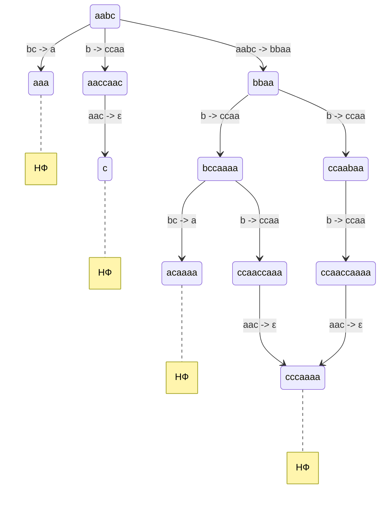
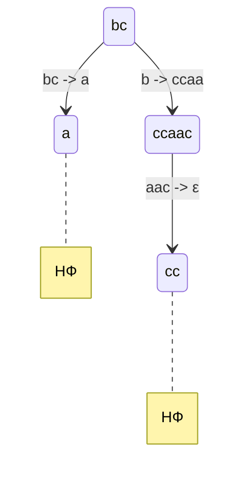
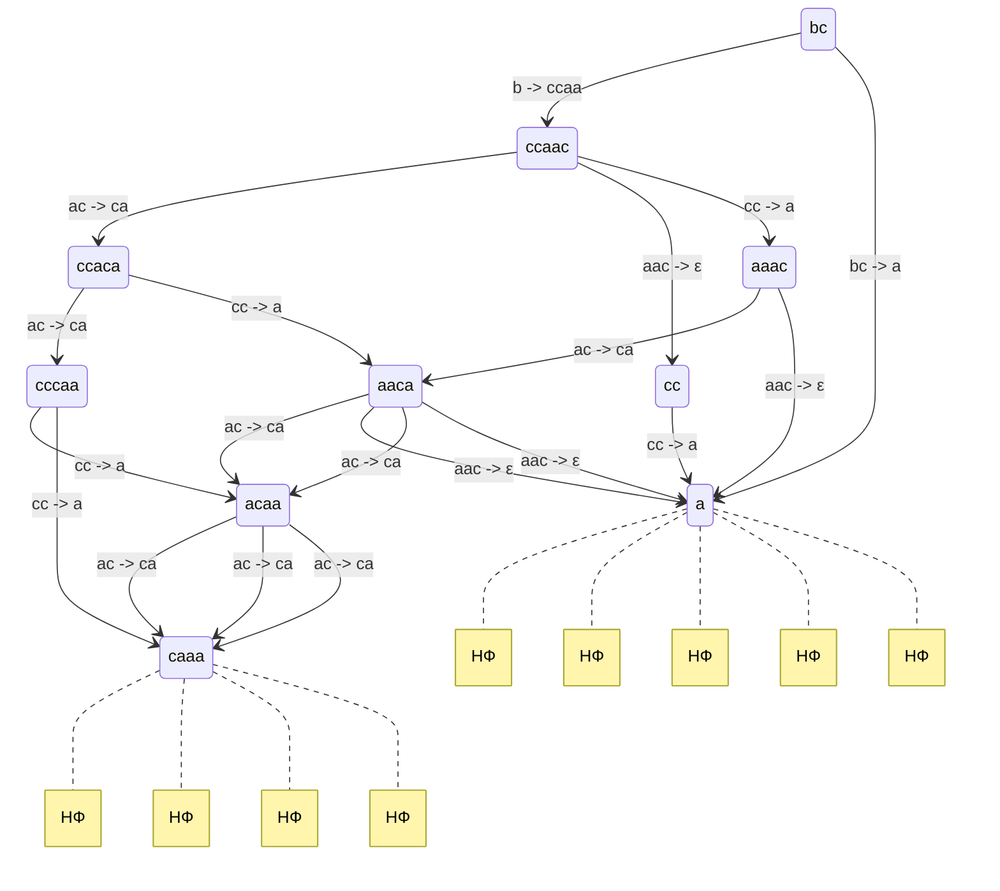
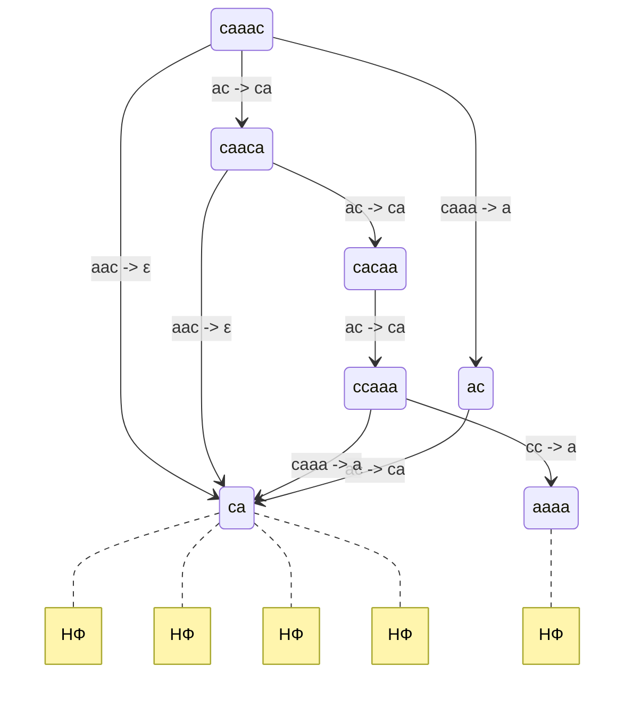
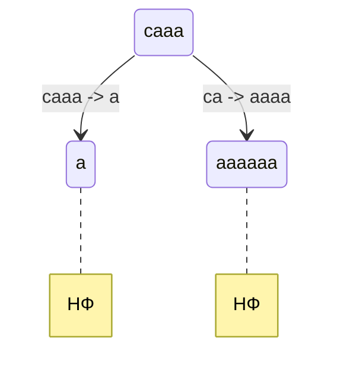

# Решение задачи о свойствах системы переписывания для исходной системы


Используя нефундированный порядок $\succ_{\text{L}}$:

- Читаем справа налево
- Лексикографически оцениваем ($\prec_{\text{lex}}$) по алфавиту: $a \prec b \prec c$
- Если суффиксы равны, то больше то слово, что длиннее: $\varepsilon \prec a$

И запустив алгоритм Кнуту-Бендикса, можно заметить, что он пополняет систему такими правилами, 
что появляется рост числа $a$ во время вычисления нормальных форм, из чего по логике
следует, что система не является завершаемой.

Тем не менее, я все же считаю, что система терменируема, 
так как $acc$ не могут вызывать новые переписывания бесконечно.

## Локальная конфлюэнтность и пополняемость по Кнуту-Бендиксу

Для исходной системы переписываний:

```math
\left\{ \begin{aligned}

    aabc  &\rightarrow bbaa \\
    b  &\rightarrow ccaa \\
    bc  &\rightarrow a \\
    aac  &\rightarrow ε \\

\end{aligned} \right.
```

### Локальная конфлюэнтность

1. Найдем критические пары

Рассмотрим строку $aabc$:



Рассмотрим также строку $bc$:



Как видно из диаграмм, многие ветви сходятся в различные нормальные формы, что доказывает отсутствие локальной и, как следствие, глобальной конфлюэнтности.

### Пополняемость по Кнуту-Бендиксу

Запустим алгоритм Кнута-Бендикса на нашей системе.

Найдем правила 

1. $cc \rightarrow a$ из строки $bb$
2. $ac \rightarrow ca$ из строки $ccc$
3. $caaa \rightarrow a$ из строки $bc$




4. $ca \rightarrow aaaa$ из строки $caaac$



5. $aaaaaa \rightarrow a$ из строки $caaa$




Далее программа [реализации алгоритма Кнуту-Бендикса](src/bin/kb.rs) 
застревает на этапе поиска нормальных форм слова $aaaaaabc$
```
Current string: aacaaaaaaaaaaaacaaaaaaaaaaaaaaaaaaaaaa
Normal forms so far: {aa}
Processing strings: {cacaabaacaaaaa, aaacaabaacaaaaaa, caaabcaaaaaaaaaa, aabcaaaaaaacaaaaaaaaaaaaaa, bbacaaaaaaaaaaaaaaaaaaaaaaaaaaa, ...}
Normal forms so far: {aa}
Applying rule aaaaaa -> a on acaaaaaaaaaaaaaacaaaaaaaaaaaaaaaaaaaaa with result {acaaaaaaaaacaaaaaaaaaaaaaaaaaaaaa}
Applying rule aaaaaa -> a on acaaaaaaaaaaaaaacaaaaaaaaaaaaaaaaaaaaa with result {acaaaaaaaaacaaaaaaaaaaaaaaaaaaaaa}
...
```