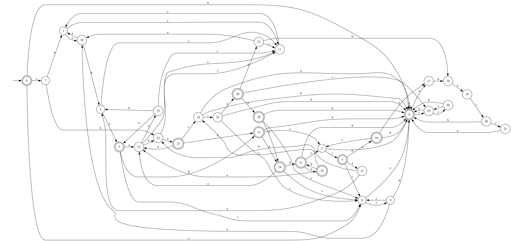
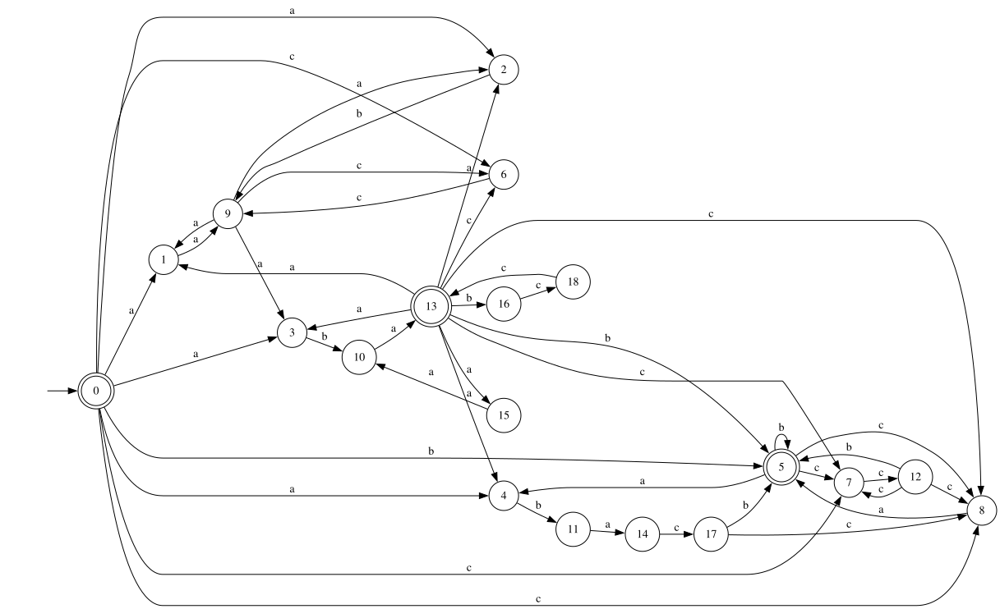
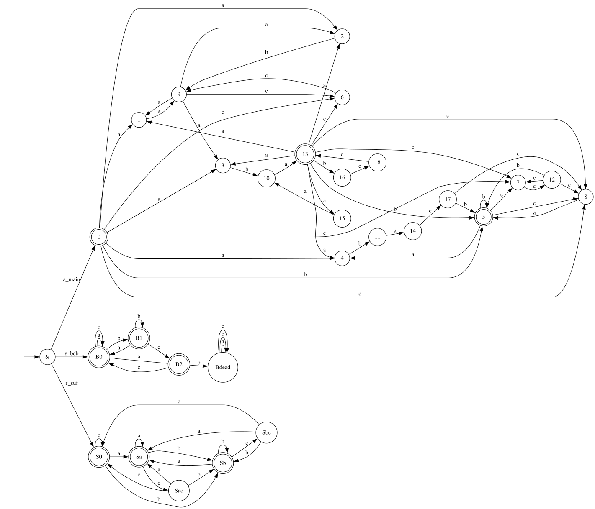

# Lab 2

## Условие

По имеющемуся академическому регулярному выражению построить:

- минимальный ДКА, распознающий его язык (минимальность обосновать таблицей классов эквивалентности)
- возможно малый НКА, распознающий его язык.

  Возможно малый переключающийся (с конъюнкцией) КА, распознающий его язык.

  Частично обосновать таблицами множеств классов эквивалентности.

- расширенное регулярное выражение, распознающее тот же язык.

  В расширенном выражении можно использовать:

  - wildcard-операцию "." для замены произвольного символа алфавита;
  - положительную итерацию τ+ и опцию τ?. τ+ = ττ∗, τ? = (τ|ε);
  - операции предпросмотра τ0(?= τ1)τ2 ≡ τ0((τ1.∗) ∩ τ2) и ретроспективной проверки τ0(?<= τ1)τ2 ≡ (τ0 ∩ (τ1.∗))τ2, а также их отрицательные версии τ0(?! τ1)τ2 ≡ τ0((τ1.∗) ∩ τ2) и τ0(?<! τ1)τ2 ≡ (τ0 ∩ (τ1.∗))τ2
  - классы букв [c1 . . . ck] ≡ (c1|c2| . . . |ck) и их дополнения [ˆc1 . . . ck].
  - (обязательно) маркеры начала и конца выражения ˆ и $.

- Провести автоматическое тестирование предполагаемой эквивалентности по-
  строенных распознавателей. Тем самым необходимо построить алгоритмы, опре-
  деляющие принадлежность слова языку академического регулярного выражения,
  ДКА, НКА и ПКА.

  Требуется только фазз-тестирование эквивалентности: строится случайное
  слово ω и проверяется, принадлежит ли он языкам регулярного выражения, ДКА,
  НКА и ПКА согласованно.

### Исходное регулярное выражение

```
((aa|ab|cc)*aba(aaa|bcc)*)*((abac|(cc)*)(b|ca))*
```

## ДКА



[Таблица](./table-dfa.md) Myhill-Nerode для ДКА

## НКА



[Таблица](./table-nfa.md) Myhill-Nerode для НКА

## ПКА



Таблица Myhill-Nerode для ПКА по логике должна совпасть с таблицей для НКА

Инварианты

- Нет подслова `bcb`
- Слово не заканчивается на `ac` или `bc`

## Расширенное регулярное выражение

- `X = (aa|ab|cc)*aba(aaa|bcc)*`
- `Y = (abac|(cc)*)(b|ca)`

Тогда всё выражение можно записать как:

```
X*Y*
```

### Добавим маркеры начала и конца строки

```
^((aa|ab|cc)*aba(aaa|bcc)*)*((abac|(cc)*)(b|ca))*$
```

### Заменим X\* на `(X+)?`

```
^((((aa|ab|cc)+)?aba((aaa|bcc)+)?)+)?(((abac|((cc)+)?)(b|ca))+)?$
```

### Используем класс символов [] вместо |

Заметим что `aa|ab` можно переписать как `a[ab]`

Тогда подвыражение `aa|ab|cc` будет `a[ab]|cc`

```
^((((a[ab]|cc)+)?aba((aaa|bcc)+)?)+)?(((abac|((cc)+)?)(b|ca))+)?$
```

## Fuzz-тестирование

[Тут](./solution/src/main.rs)

[Автоматы](./solution/src/automata.rs)

[Константы](./solution/src/constants.rs)
