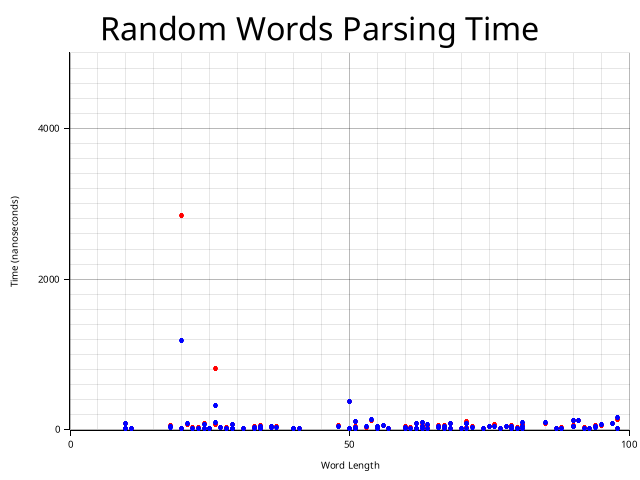
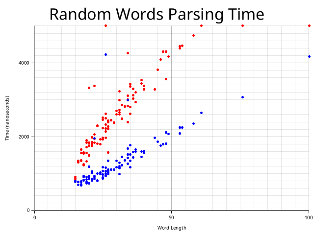
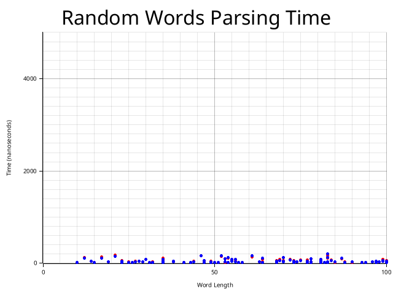

# Лабораторная работа №4

## Задание

- Проанализировать язык на КС-свойство, в случае его наличия — на регулярность.
- Построить "наивный"парсер слов для языка, используя рекурсивный разбор
  с возвратами. Парсер не должен зацикливаться.
- Построить оптимизированный парсер слов для языка. Оценить сверху его
  вычислительную сложность.
- Посредством фазз-тестирования проверить эквивалентность парсеров и по-
  строить сравнительные графики скорости их работы на случайных словах,
  принадлежащих языку, и не принадлежащих языку (два тестовых пула).

### Вариант 22

```math
L = \^{}
(?= b(?: a | bb)^*\$) \
((b | a \backslash 3) \ | \ (a \backslash 2  \backslash 2))^*\$
```

## Решение

### Анализ языка

В начале слова стоит лукэхед, такой что задает все наше слово быть вида: $b (a | bb)^*$

Дальше по проходим по слову, выбираем

- $\backslash 2 = b$ (потому что \3 еще не инициализирована) (это обновляет \2)
- $\backslash 3 = a b b = X$ (это обновляет \3)
- $\backslash 2 = a abb = aX = Y$
- $\backslash 3 = a aabb aabb = aYY = Z$
- $\backslash 2 = a aaabbaabb = a Z = Q$
- $\backslash 3 = a aaaabbaabb aaaabbaabb = aQQ = R$
- $\backslash 2 = a aaaaabbaabbaaaabbaabb = aR$

и так далее

Причем в какой-то момент мы сможем переинициализировать \2 и начать сначала, но из-за лукэхеда мы вынуждены будем иметь четное число b

То есть проходя таким образом по ссылкам мы будем добавлять слева a и удваивать текущее слово.

Тогда итоговые слова будут расти таким образом:

```math
b
```

```math
b \underbrace{a b b}_{X}
```

```math
b \underbrace{a b b}_{X} \underbrace{a \underbrace{a b b}_{X}}_{Y}
```

```math
b XY\underbrace{aYY}_Z
```

```math
b XYZ\underbrace{aZ}_Q
```

```math
b XY Z Q \underbrace{aQQ}_R
```

Пересечем с регуляркой, исключив переинициализацию \2 (тогда бы было несколько bb подряд)

```math
R = b (a^+bba^+)^+bb
```

Для доказательства не КС, нам достаточно выбрать слово, которое невозможно накачать для любого разбиения. К примеру, семейство слов, образованных чередованием \2 и \3:

Заметим, что все слова из $L \cap R$ всегда содержат подслово вида $XaX$ или $XX$ (причем даже если мы одну и ту же группу подряд)

Будем считать, что $X$ имеет длину $ > p$, где $p$ - длина накачки.

Тогда слова будут иметь вид:

```math
b (a^+ b b)^* X a X
```

```math
b (a^+ b b)^* X X
```

где $X = (a^+bb), \quad|X| > p$

Пометим $XX$ для леммы Огдена.

Тогда соблюдая условия леммы для любого разбиения $uvxyz$:

- $x$ содержит выделенную позицию
- либо $u$ и $v$, либо $y$ и $z$ обе содержат выделенные позиции
- $vxy$ содержат не более $p$ выделенных позиций

Мы обязаны задевать накачкой $XX$:

- Тогда $u$ и $v$ не могут содержать помеченных символов (иначе $y$ пустое и накачка невозможна)
- $x \in X$ непустое
- и мы не сможем качать $v^ixy^i$, потому что длина $X > p$ и $|vxy| \le p$
- Кроме того, $X$ заканчивается на $bb$, а начинается на $a$

Тогда все слова из $L \cap R$ не удовлетворяют лемме Огдена, значит $L \cap R$ не КС, значит и весь язык $L$ не КС.

### Парсеры

Сначала прогоняется лукэхед за O(n), потом

- [Наивный](./solution/src/parser/naive.rs) - разбирает рекурсией. Сложность O(2^n) в худшем случае.
- [Оптимизированный](./solution/src/parser/optimized.rs) - на каждом новом символе проверяет возможность разобрать в \2 или \3. Сложность O(n^2).

### Графики

Настраиваем длину слов и тд в [константах](./solution/src/constants.rs)

```bash
# Генерируем наборы слов (.txt)
cargo run --bin wordset

# Запускаем fuzz тестирование (.dump)
cargo run

# Строим графики (.png)
cargo run --bin plot
```

#### Рандомные слова



#### Принимаемые слова



#### Неподходящие слова



В среднем наивный парсер отклоняет слово так же быстро как и оптимизированный, но принимаемое слово распознается медленее.
