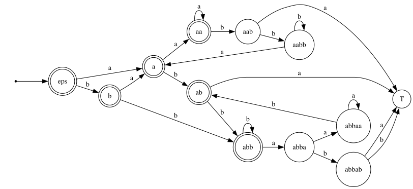

# RK 1

Вариант 24\
Федуков Александр ИУ9-52Б

---

[Задача](./task.png):

- 1, 2 &mdash; проверить на регулярность
- 3 &mdash; проверить на КС

## Задание 1

Язык контекстно-свободных грамматик в нормальной форме Хомского, порождающих язык из единственного слова, $\{ab\}$.  
Слова языка могут включать нетерминалы $S$ (где $S$ — стартовый), $A$, $B$, символ $\to$, терминалы $a$, $b$ и разделитель `;`.

### Решение

Вспомним, что [нормальная форма Хомского](https://neerc.ifmo.ru/wiki/index.php?title=%D0%9D%D0%BE%D1%80%D0%BC%D0%B0%D0%BB%D1%8C%D0%BD%D0%B0%D1%8F_%D1%84%D0%BE%D1%80%D0%BC%D0%B0_%D0%A5%D0%BE%D0%BC%D1%81%D0%BA%D0%BE%D0%B3%D0%BE) это КС грамматика вида:

- $A \to BC$,
- $A \to a$,
- $S \to \varepsilon$ (если $\varepsilon$ принадлежит языку)

где $A, B, C$ &mdash; нетерминалы, $a$ &mdash; терминал, $S$ &mdash; стартовый символ.

По условию нам нужно в итоге всегда получать только одно `ab`,
значит в соответствии с нормальной формой Хомского,
у нас будут слова вида:

$$ S \to AB; A \to a; B \to b; $$

и наоборот

$$ S \to BA; A \to b; B \to a; $$

Других вариантов получения `ab` нет, так как мы не можем получить из $S$ ничего кроме $AB$ или $BA$ не нарушая нормальную форму Хомского и наш алфавит.

Очевидно, что грамматику не получится расширить новыми правилами по типу $X \to YZ$, потому что

- НФХ не имеет переписываний в пустую строку не из $S$
- добавление иных правил приведет к появлению новых слов, отличных от `ab` (как минимум слов большей длины)

В итоге мы доказали, что число грамматик порождающих `ab` конечное, а значит и наш язык, состоящих из таких грамматик, конечен и регулярен, потому как достаточно будет построить регулярку описывающую все перестановки трех правил через `;` отдельно для обоих случаев.

## Задание 2

Язык

```math
\{\, w \mid |w|_{aab} = |w|_{bba} \ \&\ |w|_{aba} = 0 \,\}.
```

Алфавит $\{a,b\}$

### Решение

Язык регулярный.

Вот ДКА, который его распознает:


## Задание 3

Язык слов

```math
L = \{\, w_1 w_2 w_3 \mid |w_1| = |w_3| > |w_2| \ \&\ |w_1|_{ab} = |w_3|_{ba} \,\}.
```

Алфавит $\{a,b,c\}$

### Решение

Заметим что слово $w = a^n b^{n-1} c^n \in L$

Действительно, число ba = 0, а значит ab также должно быть 0, что выполняется при выборе $w_1$ <= $a^n$, кроме того условие $|w_1| = |w_3| > |w_2|$ задает единственное разбиение на $w_1=a^n, w_2=b^{n-1}, w_3=c^n$.

В таком случае легко применима лемма о накачке для КС языков.
Пусть $p$ &mdash; длина накачки. Рассмотрим слово $s = a^p b^{p-1} c^p$. По лемме о накачке, $s$ можно разбить на $uvxyz$, где $|vxy| \le p$, $|vy| \ge 1$ и для любого $i \ge 0$ слово $uv^ixy^iz \in L$.

Тогда рассмотрим случаи выбора $vxy$:

1. $vxy$ состоит из символов a/c, тогда при накачке вверх количество измениться и условие $|w_1| = |w_3|$ будет нарушено.
2. $vxy$ состоит из символов b, тогда при накачке вверх длина $w_2$ превысит $p$ и условие $|w_1| > |w_2|$ будет нарушено.
3. $vxy$ состоит из двух различных типов символов, тогда опять же при накачке вверх длина также измениться и условие $|w_1| = |w_3|$ будет нарушено.

Важно отметить, что $vxy$ не может состоять из трех типов символов, так как его длина не может быть больше $p$, а $v$ и $y$ не могут быть пустыми одновременно.

Из этого следует, что для любого разбиения найдется длина накачки выводящая слово из языка, что доказывает что этот язык не является КС.
