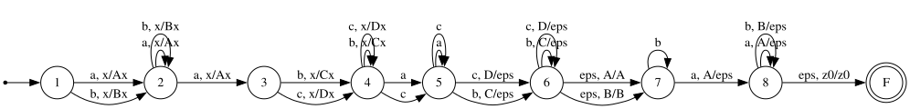

# RK 2

Вариант 21\
Федуков Александр ИУ9-52Б

---

- [Условие 1-2](./task-1-2.jpg)
- [Условие 3](./task-3.jpg)

## Задание 1

### Условие

Найти все слова, порождаемые грамматикой S -> bSS, S -> aSa, S -> bb из начального нетерминала S, в которых встречается палиндром длиной не менее 4.

```math
L = \{ w \in L_0 \mid \text{в } w \text{ встречается подслово-палиндром длины } \geq 4 \}

```

где $L_0$ это язык, порождаемый заданной грамматикой.

### Решение

#### КС

Поскольку в слове есть палиндром длиной не менее 4, это значит что в слове содержится палиндром длины 4 или 5, иначе палиндрома в слове вообще не будет.

Палиндромы длины 4:

```
aaaa, abba, baab, bbbb
```

Палиндромы длины 5:

```
aaaaa, aabaa, ababa, abbba, baaab, babab, bbabb, bbbbb
```

Тогда составим конечное множество палиндромов, заданное как объединение всех слов:

```math
P_0 =  (aaaa | abba | baab | bbbb | aaaaa | aabaa | ababa | abbba | baaab | babab | bbabb | bbbbb)
```

и тогда язык задающий все слова, содержащие палиндром длины не менее 4 будет выглядеть следующим образом:

```math
P = (b|a)^* P_0 (b|a)^*
```

Тогда наш искомый язык $L$ можно будет задать следующим образом:

```math
L = L_0 \cap P
```

где $L_0$ это язык, порождаемый заданной грамматикой (то есть КС язык), а $P$ это регулярный язык,

Пересечение КС языка и регулярного языка будет КС языком, а значит $L$ будет КС языком.

#### Регулярность

Возьмем регулярный язык $R$ заданный следующим образом:

```math
R = a^*bba^*
```

Возьмем пересечение $L$ и $R$

Учтем что в $L_0$ единственный способ получить $bb$ это поставить его в центр слова, а также что у нас должен быть палиндром хотя бы длины 4, то есть вокруг $bb$ должны быть одинаковое положительное число символов a.

```math
L \cap R = \{a^nbba^n \mid n \geq 1 \}
```

Этот язык очевидно не является регулярным по лемме о накачке, если качнем символы $a$ (соблюдая $|xy| \leq  p$), то мы не сможем сохранить равное количество символов $a$ слева и справа от $bb$.

Значит $L \cap R$ не является регулярным языком, что в свою очередь означает что $L$ не является регулярным языком.

## Задание 2

### Условие

Существуют строки $u, v, w$ такие, что

```math
wv^Ruvb^kw^Ru,
```

где

```math
u \in \{a,c\}^{+} \;\land\; w \in \{a,b\}^{+}a \;\land\; v \in \{b,c\}^{+}.
```

### Решение

Докажем что язык КС, построим NPDA


Очевидно, что построить детерминированный автомат не получится из-за пересечений символов.

Поскольку ДПДА замкнуты относительно пересечения с регулярными языками, то если бы $L$ был ДПДА, то и $L \cap R$ был бы ДПДА.

Докажем что $L \cap R$ не является ДПДА.

Докажем это через пересечение с регулярным языком.

Возьмем регулярный язык $R$ заданный следующим образом:

```math
R = ba c^+ c^+ c^+ ab c^+
```

- $w = b$
- $v = c^q$
- $u = c^r$
- $k = 0$


Тогда пересечение $L$ и $R$ будет выглядеть следующим образом:

```math
L \cap R = \{ ba (c^q)^R c^r (c^q) ab c^r \mid p, q, r \geq 1 \}
```

На моменте $(c^q)^R c^r$ мы не сможем понять где заканчивается $v^R$ и начинается $u$, поскольку символы одинаковые, а скомпенсировать это дальше мы также не сможем, поскольку дальше в слове $u$ и $v$ не стоят рядом и разделены непустым $w$, который не даст нам перекидывать символы между $u$ и $v$.

## Задание 3

### Условие

- $S \to a\,S\,b\,S$  $S.a := \min(S_1.a,\, S_2.a), S_1.a == S_2.a$
- $S \to T$  $S.a := T.a$
- $T \to a\,T\,a$  $T.a := T_1.a + 1$
- $T \to b\,T\,b$  $T.a := T_1.a$
- $T \to bb$  $T.a := 0$

### Решение

Атрибут увеличивает счетчик при нахождении пары символов 'aTa', а также требует чтобы в середине была пара 'bb'. Также есть условие на 'bTb' на равный счетчик.

Язык работает примерно следующим образом:

```
    a  S   b  S
S = a abba b abba

Не подходит, аттрибут не выполнится
S = a aabbaa b abba

Тогда добавляем еще один S и берем min в первом 
S = a (a aabbaa b abba) b (a abba b abba)
```

Таким образом мы сможем пересечь с регуляркой $R$

```math
R = aa^+bba^+ba^+bba^+
```

Получаем слова вида

```math
S = a (a^pbb a^p) b (a^p bb a^p)
```

Очевидно, что такой язык не является КС, поскольку по лемме о накачке:

- Если качаем не a^p то выходим из регулярки
- Если качаем дважды a^p внутри первой скобки, то атрибут внутри второй скобки нарушит равенство S1.a == S2.a
- Если качаем один раз a^p, тогда равенство атрибутов внутри скобки нарушится
- Если качаем a^p из двух разных скобок, тогда равенство внутри скобок нарушится


